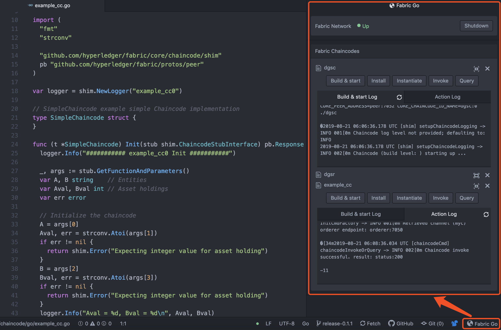

# fabric-go
It is for go chaincode debug of fabric.



## Prerequisite

1. Environment installation.

    - Nodejs: <https://nodejs.org/en/download/package-manager>
    - Docker: <https://docs.docker.com/install>
    - Docker Compose: <https://docs.docker.com/compose/install>

2. Docker images preparation for fabric.

    - Orderer image.

      ```
      $ docker pull hyperledger/fabric-orderer
      ```

    - Peer image.

      ```
      $ docker pull hyperledger/fabric-peer
      ```

    - CouchDB image.

      ```
      $ docker pull hyperledger/fabric-couchdb
      ```

    - CLI tools image.

      ```
      $ docker pull hyperledger/fabric-tools
      ```

    - Chaincode environment image.

      ```
      $ docker pull hyperledger/fabric-ccenv
      ```

## Installation

  <https://atom.io/packages/fabric-go>

## Instruction

  1. Open your .go chaincode file with atom.

  2. Toggle "Fabric Go" package in the "Packages" menu or status bar.

  3. Startup fabric network leverage "Fabric Go".

  4. Build & start your chaincode.

  5. Install > Instantiate > Invoke > Query your chaincode. After update the chaincode, you need to build & start your chaincode again.
